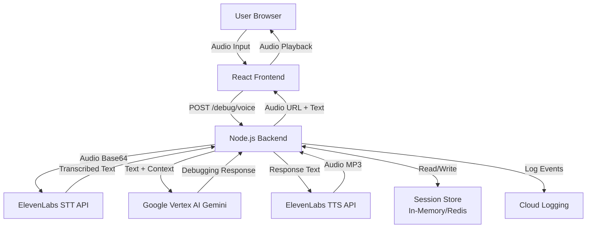

# Design Document

## Overview

The Voice-Based Rubber Duck Debugger is a full-stack web application that enables developers to debug their code through voice conversations with an AI assistant. The system follows a voice-first architecture where audio flows from the user's microphone through speech-to-text conversion, AI reasoning, and back to the user as synthesized speech.

The application consists of three main layers:
1. **Frontend Layer**: React-based single-page application handling audio capture, playback, and UI state
2. **Backend Layer**: Node.js/Express server orchestrating API calls and managing sessions
3. **External Services Layer**: ElevenLabs (STT/TTS) and Google Vertex AI (Gemini) for core AI capabilities

## Architecture

### System Architecture Diagram



### Request Flow

1. User clicks record button and speaks into microphone
2. Frontend captures audio using Web Audio API / MediaRecorder
3. Frontend sends audio (base64) + userId to POST /debug/voice
4. Backend receives request and extracts audio data
5. Backend calls ElevenLabs STT API to transcribe audio
6. Backend retrieves session context for the user
7. Backend constructs prompt with system instructions + conversation history + new input
8. Backend calls Gemini API with constructed prompt
9. Gemini returns structured debugging response
10. Backend calls ElevenLabs TTS API to generate audio from response
11. Backend stores conversation turn in session
12. Backend returns JSON with textResponse and audioUrl
13. Frontend displays text and plays audio
14. User can continue with follow-up questions

## Components and Interfaces

### Frontend Components

#### AudioRecorder Component
- **Responsibility**: Capture audio input from user's microphone
- **State**: recording status, audio blob, error messages
- **Methods**:
  - `startRecording()`: Initialize MediaRecorder and begin capture
  - `stopRecording()`: Finalize recording and return audio blob
  - `convertToBase64(blob)`: Convert audio blob to base64 string
- **Events**: onRecordingComplete, onError

#### StatusDisplay Component
- **Responsibility**: Show current system state to user
- **Props**: status (listening | thinking | playing | ready | error)
- **Rendering**: Display appropriate message and visual indicator for each status

#### AudioPlayer Component
- **Responsibility**: Play TTS audio responses
- **Props**: audioUrl, autoPlay
- **Methods**:
  - `play()`: Start audio playback
  - `pause()`: Pause playback
  - `replay()`: Restart current audio
- **Events**: onPlaybackComplete, onError

#### ConversationDisplay Component
- **Responsibility**: Show text transcript of conversation
- **Props**: conversationHistory (array of {input, output} objects)
- **Rendering**: Chronologically ordered list with user inputs and AI responses
- **Methods**:
  - `scrollToLatest()`: Auto-scroll to newest message

#### App Component
- **Responsibility**: Orchestrate all components and manage application state
- **State**: 
  - userId (generated on mount)
  - conversationHistory
  - currentStatus
  - error
- **Methods**:
  - `handleAudioSubmit(audioBlob)`: Send audio to backend
  - `updateStatus(newStatus)`: Update UI status
  - `handleError(error)`: Display error to user

### Backend Components

#### API Router (routes/debug.js)
- **Endpoint**: POST /debug/voice
- **Request Body**: 
  ```json
  {
    "audio": "base64_encoded_audio_data",
    "userId": "unique_user_identifier"
  }
  ```
- **Response**:
  ```json
  {
    "textResponse": "AI debugging response text",
    "audioUrl": "url_to_generated_audio_file"
  }
  ```
- **Validation**: Ensure audio and userId are present
- **Error Handling**: Return appropriate HTTP status codes

#### STT Service (services/stt.js)
- **Responsibility**: Interface with ElevenLabs Speech-to-Text API
- **Methods**:
  - `transcribe(audioBase64)`: Send audio to STT API and return text
  - `retryTranscribe(audioBase64)`: Retry logic with exponential backoff
- **Configuration**: API key, model selection (eleven_multilingual_v1)
- **Error Handling**: Retry once on failure, throw error if both attempts fail

#### Gemini Service (services/gemini.js)
- **Responsibility**: Interface with Google Vertex AI Gemini
- **Methods**:
  - `generateResponse(prompt, conversationContext)`: Get debugging response
  - `constructPrompt(userInput, history)`: Build full prompt with context
- **System Prompt**:
  ```
  You are a senior software engineer acting as a rubber duck debugger. 
  Do not provide immediate solutions. First, reflect the user's explanation, 
  highlight contradictions, and suggest a structured debugging path. 
  Keep responses clear, concise, and spoken naturally.
  ```
- **Configuration**: Model name, max tokens (500), temperature
- **Error Handling**: Return fallback message on failure

#### TTS Service (services/tts.js)
- **Responsibility**: Interface with ElevenLabs Text-to-Speech API
- **Methods**:
  - `synthesize(text)`: Convert text to audio and return URL/buffer
  - `retrySynthesize(text)`: Retry logic with exponential backoff
- **Configuration**: API key, voice selection, audio format (mp3)
- **Error Handling**: Retry once on failure, throw error if both attempts fail

#### Session Manager (services/sessionManager.js)
- **Responsibility**: Manage conversation context per user
- **Storage**: In-memory Map or Redis client
- **Methods**:
  - `createSession(userId)`: Initialize new session
  - `getSession(userId)`: Retrieve session data
  - `updateSession(userId, input, output)`: Add conversation turn
  - `cleanupSessions()`: Remove inactive sessions (>1 hour)
- **Data Structure**:
  ```javascript
  {
    userId: string,
    createdAt: timestamp,
    lastAccessedAt: timestamp,
    conversation: [
      { input: string, output: string, timestamp: number },
      ...
    ]
  }
  ```
- **Limits**: Maximum 20 conversation turns per session

#### Logger (utils/logger.js)
- **Responsibility**: Centralized logging for all operations
- **Methods**:
  - `logRequest(userId, endpoint)`: Log incoming request
  - `logSTT(userId, transcribedText)`: Log STT result
  - `logGemini(userId, response)`: Log Gemini output
  - `logTTS(userId, status)`: Log TTS result
  - `logError(userId, error)`: Log error details
- **Output**: Console logs (development) or Cloud Logging (production)

## Data Models

### Session Model
```typescript
interface Session {
  userId: string;
  createdAt: number;
  lastAccessedAt: number;
  conversation: ConversationTurn[];
}

interface ConversationTurn {
  input: string;
  output: string;
  timestamp: number;
}
```

### API Request Model
```typescript
interface DebugVoiceRequest {
  audio: string; // base64 encoded audio
  userId: string;
}
```

### API Response Model
```typescript
interface DebugVoiceResponse {
  textResponse: string;
  audioUrl: string;
}
```

### Error Response Model
```typescript
interface ErrorResponse {
  error: string;
  message: string;
  statusCode: number;
}
```

## Correctness Properties

*A property is a characteristic or behavior that should hold true across all valid executions of a system—essentially, a formal statement about what the system should do. Properties serve as the bridge between human-readable specifications and machine-verifiable correctness guarantees.*


### Property 1: Audio recording triggers backend processing
*For any* valid audio recording, stopping the recording should trigger an API call to the backend with the audio data and userId.
**Validates: Requirements 1.3**

### Property 2: STT transcription stores session context
*For any* successful STT transcription, the transcribed text should be stored in the user's session context.
**Validates: Requirements 2.2**

### Property 3: API retry behavior
*For any* API call (STT, TTS, Gemini) that fails on the first attempt, the system should retry exactly once with a 1-second delay before returning an error.
**Validates: Requirements 2.3, 4.3, 9.3**

### Property 4: Gemini requests include conversation context
*For any* user input with existing conversation history, the Gemini API request should include all previous conversation turns up to the most recent 20.
**Validates: Requirements 5.3**

### Property 5: Conversation history growth
*For any* completed debugging turn, the session's conversation history should grow by exactly one entry containing both input and output.
**Validates: Requirements 5.4**

### Property 6: Session size limit enforcement
*For any* session with more than 20 conversation turns, only the most recent 20 turns should be maintained in the session context.
**Validates: Requirements 5.5**

### Property 7: Status display reflects system state
*For any* system state (recording, processing, playing, ready, error), the UI should display the corresponding status message.
**Validates: Requirements 6.1, 6.2, 6.3, 6.4, 6.5**

### Property 8: Response structure completeness
*For any* successful API request to /debug/voice, the response should contain both textResponse and audioUrl fields.
**Validates: Requirements 4.4, 11.3**

### Property 9: Conversation chronological ordering
*For any* sequence of conversation turns, they should be stored and displayed in chronological order based on timestamp.
**Validates: Requirements 7.2, 12.3**

### Property 10: Comprehensive logging
*For any* request processed by the system, log entries should exist for the request initiation, STT result, Gemini result, TTS result, and any errors encountered.
**Validates: Requirements 8.1, 8.2, 8.3, 8.4, 8.5**

### Property 11: Request timeout enforcement
*For any* API request that exceeds 10 seconds, the system should terminate the request and return an error.
**Validates: Requirements 9.1**

### Property 12: Error preservation of session state
*For any* error that occurs during processing, the session context should remain unchanged and available for the next request.
**Validates: Requirements 9.5**

### Property 13: Session initialization
*For any* new user session, the system should create a session with an empty conversation array and unique session identifier.
**Validates: Requirements 5.1, 12.1**

### Property 14: Request validation
*For any* request to /debug/voice, the system should validate that both audio and userId parameters are present before processing.
**Validates: Requirements 11.4**

### Property 15: Conversation turn structure
*For any* conversation turn stored in a session, it should contain both user input text and AI output text fields.
**Validates: Requirements 12.2**

### Property 16: Session cleanup
*For any* session that has been inactive for more than 1 hour, the system should remove the session data from storage.
**Validates: Requirements 12.4**

### Property 17: Gemini configuration consistency
*For any* request to Gemini, the system should configure the model with the rubber duck debugger system prompt and a maximum of 500 tokens.
**Validates: Requirements 3.2, 3.3**

### Property 18: Audio playback automation
*For any* audio response received by the frontend, the audio should automatically begin playback.
**Validates: Requirements 4.5**

## Error Handling

### Error Categories

1. **Client Errors (4xx)**
   - Missing required parameters (audio, userId)
   - Invalid audio format
   - Audio file too large (>10MB)
   - Response: 400 Bad Request with descriptive error message

2. **External API Errors (5xx)**
   - ElevenLabs STT failure
   - ElevenLabs TTS failure
   - Google Vertex AI Gemini failure
   - Response: 500 Internal Server Error or 503 Service Unavailable

3. **Timeout Errors**
   - API requests exceeding 10 seconds
   - Response: 504 Gateway Timeout

4. **Permission Errors**
   - Microphone access denied
   - Response: Frontend error message requesting permission

### Error Handling Strategy

#### Retry Logic
- All external API calls implement retry-once strategy
- 1-second delay between initial attempt and retry
- After retry failure, propagate error to user

#### Fallback Responses
- Gemini API failure: "Sorry, I didn't fully understand, could you rephrase?"
- STT API failure: "I couldn't hear that clearly. Please try again."
- TTS API failure: Return text response only, skip audio generation

#### Error Logging
- All errors logged with:
  - Timestamp
  - User ID
  - Error type and message
  - API endpoint (if applicable)
  - Stack trace (in development)

#### Session Preservation
- Errors do not corrupt or clear session state
- Failed requests do not add entries to conversation history
- Users can retry immediately without losing context

### Error Response Format
```json
{
  "error": "ErrorType",
  "message": "Human-readable error description",
  "statusCode": 400
}
```

## Testing Strategy

### Unit Testing

The system will use **Jest** as the primary testing framework for both frontend and backend components.

#### Backend Unit Tests
- **API Router Tests**: Validate request/response handling, parameter validation, error responses
- **STT Service Tests**: Mock ElevenLabs API, test transcription logic and retry behavior
- **Gemini Service Tests**: Mock Vertex AI API, test prompt construction and response handling
- **TTS Service Tests**: Mock ElevenLabs API, test audio generation and retry behavior
- **Session Manager Tests**: Test session CRUD operations, cleanup logic, size limits
- **Logger Tests**: Verify logging calls are made with correct parameters

#### Frontend Unit Tests
- **AudioRecorder Tests**: Test recording start/stop, base64 conversion, error handling
- **StatusDisplay Tests**: Verify correct status messages for each state
- **AudioPlayer Tests**: Test playback controls, auto-play, error handling
- **ConversationDisplay Tests**: Test rendering of conversation history, scrolling
- **App Component Tests**: Test state management, API integration, error handling

### Property-Based Testing

The system will use **fast-check** for JavaScript/TypeScript property-based testing.

#### Configuration
- Each property-based test will run a minimum of 100 iterations
- Tests will use custom generators for domain-specific data (audio blobs, session data, conversation history)
- Each test will be tagged with a comment referencing the design document property

#### Property Test Format
```javascript
// Feature: voice-rubber-duck-debugger, Property 5: Conversation history growth
it('should grow conversation history by one for each completed turn', () => {
  fc.assert(
    fc.property(
      fc.string(), // user input
      fc.string(), // AI output
      (input, output) => {
        const session = createSession();
        const initialLength = session.conversation.length;
        updateSession(session.userId, input, output);
        const finalLength = session.conversation.length;
        expect(finalLength).toBe(initialLength + 1);
      }
    ),
    { numRuns: 100 }
  );
});
```

#### Property Test Coverage
- Each correctness property from this design document will be implemented as a single property-based test
- Tests will generate random valid inputs to verify properties hold across all cases
- Edge cases (empty strings, large files, timeout scenarios) will be included in generators

### Integration Testing

- **End-to-End Flow Tests**: Test complete flow from audio input to audio output
- **API Integration Tests**: Test actual calls to external APIs (in staging environment)
- **Session Persistence Tests**: Verify multi-turn conversations maintain context correctly

### Test Execution
- Unit tests run on every commit (CI/CD pipeline)
- Property-based tests run on every commit
- Integration tests run before deployment
- All tests must pass before merging to main branch

## Deployment Architecture

### Google Cloud Run Configuration

#### Container Setup
- **Base Image**: Node.js 18 Alpine
- **Port**: 8080 (Cloud Run default)
- **Environment Variables**:
  - `ELEVENLABS_API_KEY`: ElevenLabs API key
  - `GOOGLE_CLOUD_PROJECT`: GCP project ID
  - `VERTEX_AI_LOCATION`: Vertex AI region (e.g., us-central1)
  - `REDIS_URL`: Redis connection string (optional)
  - `NODE_ENV`: production
  - `SESSION_TIMEOUT`: 3600000 (1 hour in ms)

#### Resource Allocation
- **Memory**: 512 MB (minimum), 1 GB (recommended)
- **CPU**: 1 vCPU
- **Concurrency**: 80 requests per container
- **Timeout**: 60 seconds
- **Min Instances**: 0 (scale to zero)
- **Max Instances**: 10

#### Dockerfile
```dockerfile
FROM node:18-alpine
WORKDIR /app
COPY package*.json ./
RUN npm ci --only=production
COPY . .
RUN npm run build
EXPOSE 8080
CMD ["npm", "start"]
```

### Frontend Hosting
- **Option 1**: Serve static files from Cloud Run backend
- **Option 2**: Deploy to Firebase Hosting or Cloud Storage + CDN
- **Build**: React production build with optimizations

### Logging and Monitoring
- **Cloud Logging**: Automatic log collection from Cloud Run
- **Cloud Monitoring**: Track request latency, error rates, API call counts
- **Alerts**: Configure alerts for error rate >5%, latency >5s

### Security
- **HTTPS**: Enforced by Cloud Run
- **CORS**: Configure allowed origins for frontend
- **API Keys**: Stored in Secret Manager, injected as environment variables
- **Rate Limiting**: Implement per-user rate limits (e.g., 10 requests/minute)

## Performance Considerations

### Latency Optimization
- **STT Processing**: ~1-3 seconds for typical audio clips
- **Gemini Reasoning**: ~2-4 seconds for response generation
- **TTS Generation**: ~1-2 seconds for audio synthesis
- **Total Expected Latency**: 4-9 seconds per request

### Caching Strategy
- Cache Gemini responses for identical inputs (optional optimization)
- Cache TTS audio for repeated responses (optional optimization)
- Session data cached in memory or Redis for fast access

### Scalability
- Stateless backend design allows horizontal scaling
- Session data in Redis enables multi-instance deployments
- Cloud Run auto-scaling handles traffic spikes

## Development Workflow

### Local Development Setup
1. Clone repository
2. Install dependencies: `npm install`
3. Configure environment variables in `.env` file
4. Start backend: `npm run dev:backend`
5. Start frontend: `npm run dev:frontend`
6. Access application at `http://localhost:3000`

### Environment Variables Template
```
ELEVENLABS_API_KEY=your_elevenlabs_key
GOOGLE_CLOUD_PROJECT=your_gcp_project
VERTEX_AI_LOCATION=us-central1
REDIS_URL=redis://localhost:6379
NODE_ENV=development
SESSION_TIMEOUT=3600000
PORT=8080
```

### Build and Deploy
```bash
# Build frontend
npm run build:frontend

# Build Docker image
docker build -t voice-debugger .

# Deploy to Cloud Run
gcloud run deploy voice-debugger \
  --image gcr.io/PROJECT_ID/voice-debugger \
  --platform managed \
  --region us-central1 \
  --allow-unauthenticated
```

## Future Enhancements

### Phase 2 Features
- Multi-language support for international developers
- Voice activity detection for automatic recording start/stop
- Code snippet extraction from voice input
- Integration with popular IDEs (VS Code extension)
- Conversation export (text/audio)
- Custom voice selection for TTS

### Phase 3 Features
- Real-time streaming audio (WebSocket-based)
- Collaborative debugging sessions (multiple users)
- Integration with issue tracking systems (Jira, GitHub Issues)
- Advanced analytics on common debugging patterns
- Mobile app (iOS/Android)
